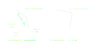
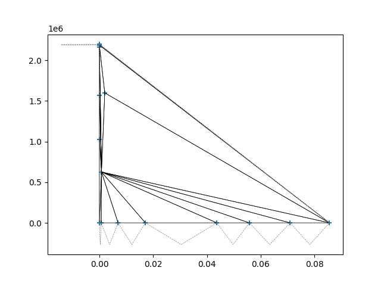
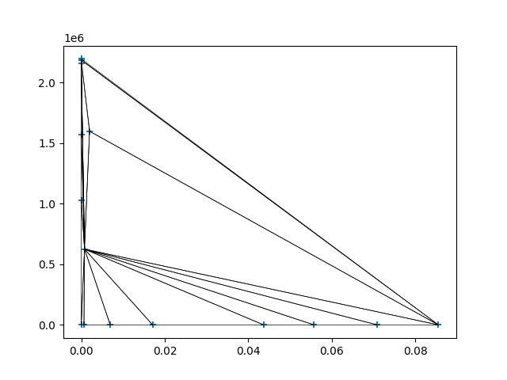

# Incremental Delaunay triangulation

## Terms and definitions

A [triangulation](https://en.wikipedia.org/wiki/Triangulation_(geometry)) connects a given set of points leading to number of triangles in a way that no edges are crossing each other.

A [Delaunay triangulation](https://en.wikipedia.org/wiki/Delaunay_triangulation) requires each triangle in a triangulation to fulfil the Delaunay condition.
To fulfill the **Delaunay condition** the point of a neighbouring triangle that is not point of the separating edge must be outside of the circum-circle of the triangle. 
The [circum-circle](https://en.wikipedia.org/wiki/Circumscribed_circle) goes through all three points of a triangle.



If the point is inside the circum-circle a flip of the separating edge leads to a fulfillment of the Delaunay-condition.

## Implementations

``incremental_delaunay`` implements two approaches of incremental Delaunay triangulations: 
- starting with a bounding structure containing all points, that is removed afterwards.
- starting with three points of the set of points that are not lying on one line

## Usage 

Both of the above mentioned [Implementations](#implementations) work similarly. 
Therefore, the following points work exemplary.

```python
point_1 = 0.0, 0.0
point_2 = 1.0, 0.0
point_3 = 0.0, 1.0
points = [point_1, point_2, point_3]
```

### Incremental Delaunay with bounding box

```python
from incremental_delaunay import DelaunayTriangulationIncrementalWithBoundingBox

delaunay = DelaunayTriangulationIncrementalWithBoundingBox(points)
```

### Incremental Delaunay

```python
from incremental_delaunay import DelaunayTriangulationIncremental

delaunay = DelaunayTriangulationIncremental(points)
```

### Using the triangles

For both implementations the instances have the attribute `delaunay.triangles`. 
That gives you a set of triangles.
To look for a point within the triangles you may iterate over the triangles as follows.

```python
point = 0.3, 0.3
for triangle in delaunay.triangles: 
    if triangle.is_inside(point): 
        print(f'{triangle=}')
        break
```

### Plotting the triangles

For plotting the triangles in the triangulated mesh you may use the following script using [matplotlib](https://matplotlib.org/) as follows.

```python
import matplotlib.pyplot as plt

def plot_mesh(
    triangles: set[Triangle] | list[Triangle], 
    halfplanes: set[Triangle] | list[Triangle] = [], 
    points:list[tuple[float, float]] = None,
): 
    fig, ax = plt.subplots()
    if not isinstance(triangles, set): 
        triangles = set(Triangles)
    if not isinstance(halfplanes, set)
        halfplanes = set(halfplanes)
    triangles = triangles.update(halfplanes)
    for triangle in triangles: 
        triangle_points = list(triangle.points)
        triangle_points.append(triangle_points[0])
        x = [values[0] for values in triangle_points]
        y = [values[1] for values in triangle_points]
        if triangle in halfplanes: 
            line_style = "dashed"
            color = 'gray'
        else: 
            line_style = "solid"
            color = 'black'
        ax.plot(x, y, linewidth=.5, linestyle=line_style, color=color)
    if points is not None: 
        x = [point[0] for point in points]
        y = [point[1] for point in points]
        ax.scatter(x, y, marker='+')
```

To plot the mesh you only have to pass your triangles to the function. 

```python
plot_mesh(
    triangles=delaunay.triangles, 
    points=delaunay.points
    )
```

In case you use ``DelaunayTriangulationIncremental`` for triangulation you may also pass the halfplanes as follows. 

```python
plot_mesh(
    triangles=delaunay.triangles, 
    halfplanes=delaunay.halfplanes,
    points=delaunay.points
    )
```

## Examples

The following set of points may be triangulated. 

```python
points = [
    (0.07092164560897417, 0.0),
    (0.017112718875810836, 0.0),
    (0.04368081778528715, 0.0),
    (0.0019914537568356126, 1599523.0516000006),
    (0.0557740946375556, 0.0),
    (-0.0, -0.0),
    (0.0007794542880783402, 626052.8855962341),
    (0.0006552638255870223, 0.0),
    (0.006952534477383593, 0.0),
    (0.0, 2186719.193349065),
    (0.08556008688854429, 0.0),
    (0.0, 2161363.834659677),
    (0.0, 1029329.0652537956),
    (0.0, 2196771.511936398),
    (0.0, 1568852.9374282872),
]
```

For triangulation you only have to pass the created ``points``-list to ``DelaunayTriangulationIncrementalWithBoundingBox`` or ``DelaunayTriangulationIncremental``.

```python
from incremental_delaunay import DelaunayTriangulationIncremental
delaunay = DelaunayTriangulationIncremental(points)
```

Using ``plot_mesh`` plots you the triangles and the halfplanes. 
The blue ``+``-signs indicate the positions of the ``points``. 
The dashed lines show the halfplanes, whereas the solid lines show the triangles.

```python
plot_mesh(
    triangles=delaunay.triangles, 
    halfplanes=delaunay.halfplanes, 
    points=points
)
```



If you only want to show the triangles you must skip passing the halfplanes to ``plot_mesh``.
This produces the same figure as above, but without halfplanes (dashed triangles on the border).

```python
plot_mesh(
    triangles=delaunay.triangles, 
    # halfplanes=delaunay.halfplanes, 
    points=points
)
```


As shown in the plotted figures the points are the corners of the triangles.
There is no point without at least one triangle and no triangle with at least three corner points. 


## Development history

Within [m-n-kappa](https://johannesschorr.github.io/M-N-Kappa/) I looked for a way to interpolate values in a set of points.
As [bilinear Interpolation](https://en.wikipedia.org/wiki/Bilinear_interpolation) did not work the way as expected, I decided to build a mesh of triangles from the given set of points. 
A triangulation considering the Delaunay-conditions produces triangles that are optimal conditioned for interpolation. 

The Delaunay-implementation with a bounding box did also not work as expected for the given problem as some points were deleted due to their connection to the bounding box. 
The bounding box is removed at the end of the triangulation. 

Therefore, I implemented the Delaunay triangulation without a bounding box, but with half-planes at the borders of the mesh. 
Some publications call these half-planes 'ghost triangles' as the implemented algorithms work similarly.  

In ``m_n_kappa`` you may find the Delaunay-implementation not starting with a bounding structure.